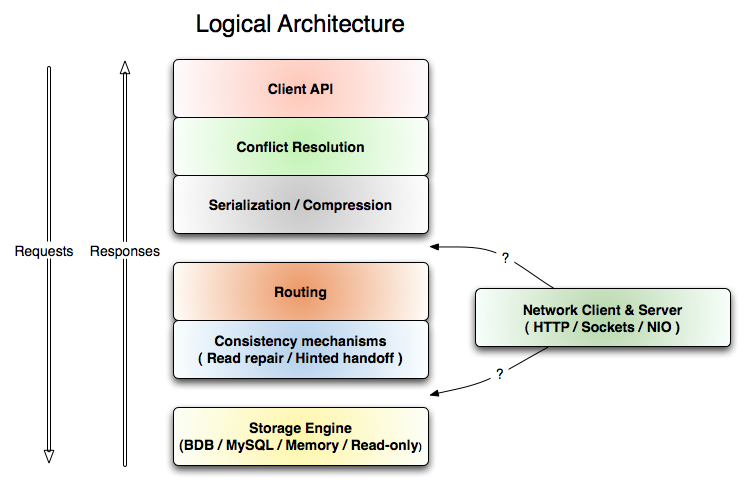
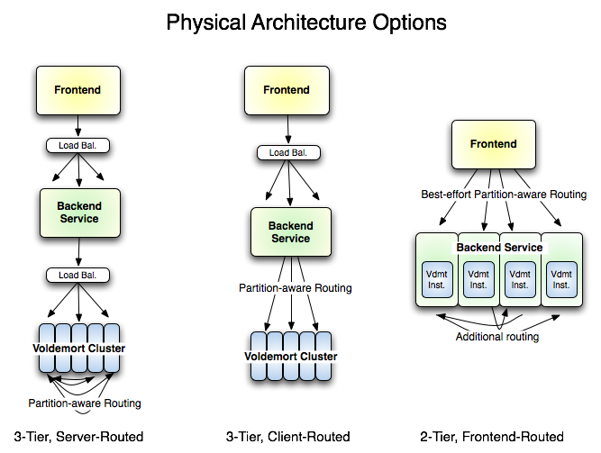

# 首页

## Voldemort是一个分布式键值存储系统

+ 数据将自动复制到多个服务器上。
+ 数据会自动分区，因此每个服务器仅包含全部数据的一个子集
+ 提供可调的一致性（严格的仲裁或最终一致性）
+ 可透明地处理服务器故障
+ 可插拔存储引擎-BDB-JE，MySQL，只读
+ 可插拔序列化-协议缓冲区 ，Thrift，Avro和Java序列化
+ 数据项经过版本控制，可在故障情况下最大限度地提高数据完整性，而不会影响系统的可用性
+ 每个节点都独立于其他节点，没有任何中心故障或协调点
+ 良好的单节点性能：您可以预期10-20k 每秒的操作次数，具体取决于机器，网络，磁盘系统和数据复制因子
+ 支持可插拔数据放置策略，以支持诸如在地理上相距较远的数据中心之间进行分配  

LinkedIn上有大量的重要服务在该网站的很大一部分中使用它。

## 与关系数据库的比较

Voldemort不是关系数据库，它不会在满足ACID属性的同时尝试满足任意关系。它也不是试图透明地映射对象参考图的对象数据库。它也没有引入诸如文档定向之类的新抽象。它基本上只是一个大的，分布式的，持久的，容错的哈希表。对于可以使用O / R映射器（例如活动记录或休眠）的应用程序，这将提供水平可伸缩性和更高的可用性，但会带来极大的便利性损失。对于处于Internet类型可伸缩性压力下的大型应用程序，系统可能由许多功能分区的服务或API组成，这些服务或API可以使用本身可以水平分区的存储系统来管理多个数据中心的存储资源。对于该领域的应用程序，已经不可能进行任意的数据库内联接，因为所有数据在任何单个数据库中均不可用。一种典型的模式是引入一个缓存层，该缓存层无论如何都需要哈希表语义。对于这些应用程序，Voldemort具有许多优点：

+ Voldemort将内存缓存与存储系统结合在一起，因此不需要单独的缓存层（相反，存储系统本身就是快速的）
+ 与MySQL复制不同，读取和写入都可以水平扩展
+ 数据分区是透明的，并且允许集群扩展而无需重新平衡所有数据
+ 数据复制和放置由一个简单的API决定，能够适应各种特定于应用程序的策略
+ 存储层是完全可模拟的，因此可以针对一次性内存存储系统进行开发和单元测试，而无需一个真实的集群（甚至一个真实的存储系统）进行简单测试

源代码在Apache 2.0许可下可用。我们正在积极寻找贡献者，因此，如果您有想法，代码，错误报告或修复程序想要贡献，请这样做。
要获得帮助，请参阅讨论组或irc.oftc.net上的IRC频道#voldemort。

# Quickstart 快速开始
## 快速开始
### 步骤1：下载并构建代码
运行以下命令以获取最新和最好的Voldemort版本：
    git clone https://github.com/voldemort/voldemort 
    cd voldemort
    ./gradlew build -x test
或者，您可以在此处获取有关点发布的存档。
### 步骤2：启动单节点群集
    > bin/voldemort-server.sh config/single_node_cluster > /tmp/voldemort.log &
注意：如果您的计算机内存很小（<4G，可能在虚拟机环境中发生），则可能会遇到内存不足的问题。您可以通过将bin / voldemort-server.sh中的“ -Xmx2G”选项更改为较小的值或将其省略来减少JVM堆内存的分配。
### 步骤3：启动命令行测试客户端并执行一些操作
    > bin/voldemort-shell.sh test tcp://localhost:6666
    Established connection to test via tcp://localhost:6666
    > put "hello" "world"
    > get "hello"
    version(0:1): "world"
    > delete "hello"
    > get "hello"
    null
    > help
    ...
    > exit
    k k thx bye.

## 更多细节
### 客户端
这是一个示例，显示了如何作为客户端连接到存储以从Java进行读取和写入：
     String bootstrapUrl = "tcp://localhost:6666";
    StoreClientFactory factory = new SocketStoreClientFactory(new ClientConfig().setBootstrapUrls(bootstrapUrl));

    // create a client that executes operations on a single store
    StoreClient<String, String> client = factory.getStoreClient("my_store_name");

getStoreClient()方法从服务器的引导URL中拉出元数据（cluster.xml / stores.xml）。为每个存储初始化存储客户端后，我们可以重新使用它来运行我们的查询，如下所示：
    //做一些随机的无意义的操作
    Versioned<String> value = client.get("some_key");
    value.setObject("some_value");
    client.put("some_key", value);

请注意，StoreClient只是一个接口，因此出于单元测试的目的，我们可以完全模拟存储层。对于普通的关系数据库，这基本上是不可能的，因为sql是接口，并且是特定于供应商的。
### 服务器
有三种使用服务器的方法：
#### 1.从命令行开始
您必须如上所述首先使用ant构建jar文件，然后执行以下操作：
    $ VOLDEMORT_HOME='/path/to/voldemort'
    $ cd $VOLDEMORT_HOME
    $ ./bin/voldemort-server.sh
或者，我们可以在命令行上提供VOLDEMORT_HOME，而不必设置环境变量
    $ ./bin/voldemort-server.sh /path/to/voldemort

#### 2.嵌入式服务器
您可以直接在代码中实例化服务器。
    VoldemortConfig config = VoldemortConfig.loadFromEnvironmentVariable();
    VoldemortServer server = new VoldemortServer(config);
    server.start();
#### 3.部署为war
为此，使用./gradlew war目标构建war文件，并通过servlet容器支持的任何机制进行部署。

# Design 设计
## 键值存储
为了实现高性能和可用性，我们仅允许非常简单的键值数据访问。键和值都可以是复杂的复合对象，包括列表或映射，但是尽管如此，唯一受支持的查询实际上是以下各项：
	value = store.get(key)
	store.put(key, value)
	store.delete(key)

对于所有存储问题来说，这绝对不够好，需要权衡各种因素：
缺点：
+ 没有复杂的查询过滤器
+ 所有联接必须在代码中完成
+ 没有外键约束
+ 没有触发器
优点：
+ 只有高效的查询才是可能的，非常容易预测的性能
+ 易于在集群服务导向的整个集群之间分配
+ 通常不允许外键约束，并且无论如何都要强制使用代码在数据库中执行连接（因为键是指另一服务维护的数据）
+ 使用关系数据库，您需要一个缓存层来扩展读取，无论如何，缓存层通常会迫使您进入键值存储
+ 经常以xml或其他非规范化的blob结束以提高性能
+ 完全分离存储和逻辑（SQL鼓励将业务逻辑与存储操作混合使用，以提高效率）
+ 没有对象关系不匹配
数据模型细节的更多讨论将在下面给出。
## 系统架构
代码中的每一层都实现了一个简单的存储接口，该接口可以放置，获取和删除。这些层中的每一层都负责执行一项功能，例如tcp / ip网络通信，序列化，版本协调，节点间路由等。例如，路由层负责执行一项操作，例如PUT，并将其委托给同时处理所有N个存储副本，同时处理所有故障。

将这些层中的每一个保持独立意味着可以在运行时将它们混合和匹配以满足不同的需求。例如，我们可以添加一个压缩层，该层压缩低于串行化级别的任何级别的字节值。同样，我们可以灵活地将数据智能路由到分区。可以在客户端上为“智能”客户端完成此操作，也可以在服务器端完成此操作，以启用笨拙的，硬件负载平衡的http客户端（例如用Ruby编写）。我们要做的只是网络层是位于路由层之上还是之下。

在上图中的“ Load Bal”。表示硬件负载平衡器或循环软件负载平衡器，“分区感知路由”是存储系统内部路由。显然，从延迟的角度来看，更少的跃点是好的（因为，那么，跳数会更少），从吞吐量的角度来看，这是很好的（因为潜在的瓶颈更少），但是需要路由智能向上移动堆栈（例如，客户端必须 Java，并使用我们的库）。在最后一张最右边的图片中，对服务的http-rpc请求被路由到包含正确数据的计算机（如果可能），因此，在单个复制读取的简单情况下，该计算机需求可以直接从服务器获取。
本地进程内bdb。  
这种灵活性使高性能配置成为可能。磁盘访问是影响存储性能的最大因素，其次是网络跃点。可以通过对数据集进行分区和高速缓存来避免磁盘访问。网络跃点需要消除架构上的灵活性。请注意，在上图中，我们可以使用不同的配置实现3跳，2跳和1跳远程服务。当可以将服务调用直接路由到适当的服务器时，这可以实现很高的性能。

### 数据分区和复制
数据需要在服务器群集之间进行分区，以便没有一个服务器需要保存完整的数据集。即使数据可以容纳在单个磁盘上，对小值的磁盘访问也受寻道时间的支配，因此分区具有通过将“热”数据集分成较小的块（希望（可以）完全位于）中来提高缓存效率的效果。存储该分区的服务器上的内存。这意味着群集中的服务器不可互换，并且需要将请求路由到保存请求数据的服务器，而不仅仅是随机发送到任何可用服务器。
同样，服务器经常会发生故障，变得过载或为维护而停机。如果有S台服务器，并且假定每台服务器在给定的一天内独立发生故障的概率为p，则每天丢失至少一台服务器的概率为$1-(1-p)^s$。显然，鉴于这一事实，我们不能仅在一个服务器上存储数据，否则数据丢失的可能性将与群集大小成反比。
实现此目的的最简单方法是将数据切成S个分区（每个服务器一个），并将给定密钥K的副本存储在R服务器上。将R服务器与密钥K关联的一种方法是取= K mod S并将值存储在服务器a，a + 1，...，a + r中。因此，对于任何概率p，您都可以选择适当的复制因子R，以实现可接受的低数据丢失概率。
该系统具有很好的属性，任何人都可以仅通过知道其键就可以计算值的位置，这使我们能够以对等方式进行查找，而无需联系具有所有键映射关系的中央元数据服务器。到服务器。
当添加服务器或从群集中删除服务器时，上述方法的缺点是（例如，因为我们购买了新硬件或服务器暂时关闭）。在这种情况下，d可能会更改，所有数据将在服务器之间转移。如果d不变，则事件不会从单个已删除/发生故障的服务器平均分布到群集的其余部分。
一致性哈希是一种避免这些问题的技术，我们使用它来计算集群上每个键的位置。使用此技术，voldemort具有以下属性：当服务器发生故障时，负载将平均分配给群集中所有剩余的服务器。同样，将新服务器添加到S个服务器的群集中时，只需将1 /（S + 1）值移到新计算机上。
为了可视化一致的哈希方法，我们可以将可能的整数哈希值看成一个从0开始到2 ^ 31-1的圆环。该环被划分为Q个相等大小的Q个分区，其中Q >> S，并且为S个服务器中的每个服务器分配了Q / S个。使用任意哈希函数将密钥映射到环上，然后当按顺时针方向在分区上移动时，通过获取第一个R个唯一节点来计算负责此密钥的R个服务器的列表。下图显示了服务器A，B，C，D的哈希环。箭头指示映射到哈希环上的密钥，以及如果R = 3，将存储该密钥的值的服务器结果列表。

## 数据格式和查询
在关系数据库中，数据分为2D表。这里的等效项是一个“存储”，我们不使用单词表，因为数据不一定是表格形式的（值可以包含列表和映射，而在严格的关系映射中不考虑这些列表和映射）。每个密钥是商店唯一的，每个密钥最多可以有一个值。
### 查询
Voldemort支持哈希表语义，因此可以一次修改单个值，并通过主键进行检索。这使得跨机器的分发特别容易，因为所有内容都可以通过主键拆分。
请注意，尽管我们不支持一对多关系，但我们确实将列表支持为完成相同功能的值-因此可以存储与单个键关联的合理数量的值。这对应于java.util.Map，其中值是java.util.List。在大多数情况下，这种非规范化可以极大地提高性能，因为只有一组磁盘搜索。但是对于必须保留在服务器上并通过游标延迟地流过的非常大的一对多关系（例如，键映射到数千万个值），这种方法不切实际。这种（稀有）情况必须分解为子查询，或者在应用程序级别进行其他处理。
查询的简单性可能是一个优势，因为每个查询的性能都非常可预测，因此很容易将服务的性能分解为它执行的存储操作的数量并快速估算负载。相比之下，SQL查询通常是不透明的，执行计划可能取决于数据，因此很难估计给定查询在负载下对真实数据是否表现良好（尤其是对于既没有数据也没有负载的新功能）。
同样，具有三个操作接口可以透明地模拟整个存储层，并使用仅比HashMap多的模拟存储实现进行单元测试。这使得在特定容器或环境外部进行单元测试更加实用。
### 数据模型与序列化
Voldemort中的序列化是可插入的，因此您可以使用其中一种序列化器，也可以轻松编写自己的序列化器。在最低级别上，Voldemort的数据格式只是键和值的字节数组。更高级别的数据格式是为每个商店设置的配置选项-通过实现处理字节与对象之间的转换的Serializer类，可以支持任何格式。这样做可以确保客户端正确地序列化字节。
通过在商店配置中输入适当的类型，可以立即支持以下类型：
+ json –一种二进制类型的JSON数据模型，支持各种精度的列表，地图，日期，布尔值和数字。这是唯一具有字节<->对象和字符串<->对象的完整映射的序列化类型。这意味着它可以与类似SQL的方式进行交互（例如，通过命令行客户端）。我们当前的生产使用情况是使用类型化的，紧凑的，经过模式检查的类似于JSON的格式； 但这没有特殊的地位，对于其他应用程序，其他序列化机制可能更好。
+ string –仅存储原始字符串。对XML Blob有用。
+ java-serialization –我们的老朋友Java序列化。在存储太多的Java对象之前，请确保您了解Java序列化提供的兼容性保证。
+ protobuf –协议缓冲，是Google的代码生成序列化格式。如果不需要命令行访问，这可能是首选的方式。
+ Thrift – Thrift是另一种代码生成序列化格式。
+ avro-generic / avro-specific / avro-reflective -Avrois另一个丰富的数据序列化系统。
+ identity –这有效地禁用了序列化，只给了您确切的字节[]。
字符串和身份序列化是不言而喻的。其他序列化格式的文档/教程可以在Internet上轻松找到。因此，本节的其余部分描述了json类型背后的动机。
### JSON序列化类型详细信息
数据可能处于三种状态，我们希望能够在所有状态之间进行转换：
+ 在内存数据结构中：例如，一个User对象
+ 持久性和网络传输字节
+ 文本表示：能够让DBA检查某些值并进行在线更新而无需编写新代码是至关重要的
SQL基本上围绕文本查询格式进行标准化，程序处理这些字符串与程序使用的内部数据结构之间的映射。这是经典的对象关系映射问题。
JSON是一种出色的存储数据模型，因为它支持所有编程语言（字符串，数字，列表/数组和对象/哈希表）中使用的通用类型；问题在于它本质上是无架构的。对于任何存储问题，最常见的用例是让N行全部具有完全相同的格式（即包含相同的列），在这种情况下JSON是浪费的，因为JSON将数据格式存储在每一行中。同样，我们希望能够检查有关数据形式的断言，以避免允许拼写错误的列存储损坏的数据。为避免这种情况，我们应该能够为每个存储的键和值分配一个架构，该架构描述了允许在此处存储的内容以及如何在字节之间进行转换。本身也可以使用以下类型在JSON中指定模式：
int8, int16, int32, int64, float32, float64, 
string, date, object, bytes, boolean, object, array
例如，如果我希望商店包含字符串，则可以将该表的类型指定为
“string”
请注意，此类型定义本身就是有效的JSON
然后，获取数据的Java代码将返回一个String
如果我希望商店包含整数列表（例如，成员ID），则可以将类型指定为
[“int32”]
然后，Java代码将返回List\<Integer>
如果我希望商店包含一个简单的用户对象，则可以将类型定义为
{"fname":"string", "lname":"string", "id":"int32", "emails":["string"]}
这里的Java代码将返回一个Map <String，Object>，其中包含每个给定键以及关联的值。
这是允许的类型的完整列表：
表略
从这个意义上说，类型定义是对标准json的一组限制，这些限制使序列化有效（通过去除重复的字段并紧凑地存储数字）并允许基本数据正确性检查。
请注意，即使值可能具有所有这些不同的字段，我们也仅支持通过商店的已定义键进行查询。
为了帮助模式演变，此JSON实现包括对模式进行版本控制以允许逐步迁移数据的功能。数据将始终使用最新的架构进行写入，但始终将使用用于写入数据的任何架构进行读取。这样就可以进行架构迁移，而无需关闭获取数据的服务。
## 一致性和版本控制
当进行分布在多个服务器（可能是多个数据中心）上的多个同时写操作时，数据的一致性成为一个难题。解决此问题的传统方法是分布式事务，但是它们既缓慢（由于多次往返）又很脆弱，因为它们要求所有服务器都可用以处理事务。特别是，如果应用程序在多个数据中心中运行，则必须与50％以上的服务器进行通信以确保一致性的任何算法都变得非常成问题，因此跨数据中心操作的延迟将非常高。
一种替代解决方案是容忍不一致的可能性，并在读取时解决不一致问题。这就是这里采用的方法。
修改数据时，应用程序通常执行读取-修改-更新序列。例如，如果用户将电子邮件地址添加到其帐户，我们可能会加载该用户对象，添加电子邮件，然后将新值写回到数据库。数据库中的事务是解决此问题的一种方法，但是当事务必须跨越多个页面加载（可能完成或可能不完成，并且可以在任何特定时间范围内完成）时，这不是真正的选择。
如果在没有更新的情况下，对该键的所有读取都返回相同的值，则给定键的值是一致的。在只读环境中，数据是以一致的方式创建的，并且不会更改。当我们同时添加写操作和复制操作时，我们会遇到问题：现在，我们需要在多台计算机上更新多个值并使事物保持一致状态。在服务器故障的情况下，这是非常困难的，在存在网络分区的情况下，这是不可能的（分区是指，例如，当A和B可以相互访问，而C和D可以相互访问，但是A和B可以无法达到C和D）。
有几种方法可以通过不同的保证和性能折衷来达到一致性。

+ 两阶段提交-这是一个锁定协议，涉及机器之间的两轮协调。它完全一致，但不能容错，而且非常慢。
+ Paxos风格的共识-这是一个协议，旨在就更能容忍失败的价值达成协议。
+ 读取修复-前两种方法可以防止永久性的不一致。此方法涉及编写所有不一致的版本，然后在读取时检测到冲突并解决问题。这几乎不需要协调，完全可以容错，但是可能需要其他应用程序逻辑来解决冲突。

我们使用版本控制和读取修复。这具有最佳的可用性保证和最高的效率（N个副本只需要W写网络往返，其中W可以配置为小于N）。2PC通常需要2N次阻塞往返。Paxos的变化很大，但与2PC相当。
达到一致性的另一种方法是使用提示切换。在写入过程中，如果发现目标节点处于关闭状态，则在此方法中，我们会将更新值的“提示”存储在其中一个活动节点上。然后，当这些下行节点恢复正常时，将“提示”推向它们，从而使数据保持一致。许多细节是从下面的亚马逊文章中借来的
以下是有关此主题的一些不错的文章：
亚马逊Dynamo的一致性 http://the-paper-trail.org/blog/?p=51
Paxos变得简单http://lamport.azurewebsites.net/pubs/paxos-simple.pdf
两阶段提交https://en.wikipedia.org/wiki/Two-phase_commit_protocol
最终一致性的含义（由亚马逊的首席技术官沃纳·沃格斯（Werner Vogels）撰写）http://www.allthingsdistributed.com/2008/12/eventually_consistent.html

## 分布式系统中的版本控制
一个简单的版本控制系统就是乐观锁定—我们为每个数据存储一个唯一的计数器或“时钟”值，并且仅当更新指定了正确的时钟值时才允许更新。
这在集中式数据库中效果很好，但是在分布式系统中会出现故障，服务器在其中出现或消失，复制可能会花费一些时间。对于这种用法，单个值将无法包含足够的写入历史记录，因此我们无法丢弃旧版本。请考虑以下操作顺序：

# Configuration结构
有三个配置文件可控制服务器的操作：
+ *cluster.xml* –这包含有关集群中所有节点（即服务器），它们在什么主机名，它们使用的端口等的信息。对于所有voldemort节点来说都是完全相同的。它不保存那些节点的调整参数或数据目录，因为这不是群集公开的信息，而是特定于该特定节点配置的信息。
+ *stores.xml* –这包含有关集群中所有存储（即表）的信息。这包括有关维持一致性所需的成功读取次数，所需的写入次数以及如何将键和值序列化为字节的信息。在集群中的所有节点上都相同。
+ *server.properties* –这包含控制特定节点的调整参数。这包括本地节点的ID，因此它知道cluster.xml中的哪个条目与其自身相对应，还知道线程池大小，以及本地持久性引擎（例如BDB或mysql）所需的任何配置。该文件在每个节点上都不同。
最后，还有一个环境变量VOLDEMORT_HOME，它控制数据和配置所在的目录。您可以在项目的config /子目录中看到有关配置布局的示例。这包括您可以根据自己的具体情况修改的示例配置。
## 集群配置
这是一个具有8个数据分区的2节点集群的示例cluster.xml。我们还具有可选的“区域”字段，可用于将节点映射到称为区域的某些逻辑集群（数据中心，机架等）：
	<cluster>
    <!-- The name is just to help users identify this cluster from the gui 该名称只是为了帮助用户从gui中识别此集群-->
    <name>mycluster</name>
    <zone>
      <zone-id>0</zone-id>
      <proximity-list>1</proximity-list>
    <zone>
    <zone>
      <zone-id>1</zone-id>
      <proximity-list>0</proximity-list>
    <zone>
    <server>
      <!-- The node id is a unique, sequential id beginning with 0 that identifies each server in the cluster   id是一个以0开头的唯一顺序id，用于标识集群中的每个服务器-->
      <id>0</id>
      <host>vldmt1.prod.linkedin.com</host>
      <http-port>8081</http-port>
      <socket-port>6666</socket-port>
      <admin-port>6667</admin-port>
      <!-- A list of data partitions assigned to this server -->
      <partitions>0,1,2,3</partitions>
      <zone-id>0</zone-id>
    </server>
    <server>
      <id>1</id>
      <host>vldmt2.prod.linkedin.com</host>
      <http-port>8081</http-port>
      <socket-port>6666</socket-port>
      <admin-port>6667</admin-port>
      <partitions>4,5,6,7</partitions>
      <zone-id>1</zone-id>
    </server>
  </cluster>

要理解的一件事很重要，那就是分区不是服务器的静态分区，而是分区的一种划分方式，该方式可以将每个密钥静态映射到特定的数据分区。这意味着特定的群集可能支持许多具有不同复制因子的存储，而复制因子并未在群集设计中进行硬编码。这很重要，因为某些数据比其他数据更重要，并且一个商店的性能和一致性之间的正确权衡可能与另一个商店不同。
要记住的另一个重要点是，不能更改数据分区的数量。我们确实支持分区的在线重新分发（重新平衡）。换句话说，包含新节点会导致移动分区的所有权，但是分区的总数将始终保持不变，密钥到分区的映射也将保持不变。这意味着提供大量的分区开始很重要。此处的脚本将为您生成配置的这一部分。
请注意，当前配置是简单文件，因此在每台服务器上，cluster.xml和stores.xml中的数据必须完全相同，并且节点ID和分区不可更改，这一点很重要，因为这可能意味着客户端会认为当它们的数据确实存储在节点Y上时，它们的数据应该在节点X上。随着配置移入voldemort本身，该限制将被消除。
## 商店配置
这是一个名为test的商店的stores.xml示例，该商店仅需一次读写即可使用bdb进行持久化：