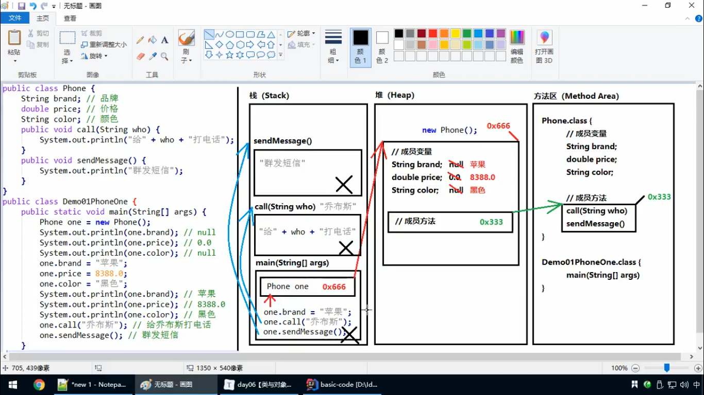

### 1.2 计算机基础知识
#### 字节
位bit
字节Byte，数据存储的最小单位
1 Byte = 8 bit
#### 常用DOS命令
1. 切换盘符：
    `盘符名称：`
盘符名称不区分大小写
2. 进入文件夹：
注意：在win10的cmd里，Tab补全的时候连按可以切换
    `cd 文件夹名称`
3. 进入多级文件夹：
    `cd 文件夹1\文件夹2\文件夹3`
4. 返回上一级：
    `cd ..`
5. 直接返回根路径：
    `cd \`
6. 查看当前目录下的文件：
    `dir`
7. 清屏：
   ` cls`
8. 退出cmd：
    `exit`
## 第二章 Java语言开发环境搭建
### 2.1 Java虚拟机——JVM
Java语言有跨平台特性
java虚拟机（Java Virtual Machine）本身不具备跨平台功能，每个操作系统下都有不同版本的虚拟机
### 2.3 JDK9安装图解
+ 在cmd里运行.exe文件的时候可以省略后缀
### 2.4 JAVA_HOME环境变量的配置
+ JAVA_HOME
+ Path
%JAVA_HOME%\bin
【这里他安装的时候去掉了最下面的独立的JRE，加环境变量的时候也没加%JAVA_HOME%\jre\bin】
【CLASSPATH = .;%Java_Home%\bin;%Java_Home%\lib\dt.jar;%Java_Home%\lib\tools.jar】
## 第三章 HelloWorld入门程序
### 3.1 程序开发步骤说明
编写、编译、运行
javac.exe：编译器
java.exe：解释器

### 3.3 编译Java源文件
javac HelloWorld.java
### 3.4 运行Java程序
java HelloWorld
### 3.5 入门程序说明
#### 编译和运行是两回事
#### 关于main方法
程序执行的起点
### 3.6 添加注释comment
    //单行注释
    /*
    多行注释
    */
### 3.7 关键字keywords
+ 完全小写的单词
+ 在IDE中有特殊颜色
### 3.8 标识符
类名、方法名、变量名等
+ 包含字母、数字、$、_
+ 不能以数字开头
+ 不能是关键字
  + 类名：大驼峰
  + 变量和方法：小驼峰

## 第四章 常量
+ 字符类型两个单引号中间不能什么都不写
+ 不能直接println(null)
## 第五章 变量和数据类型
### 5.1 变量概述
### 5.2 数据类型
#### 数据类型分类
基本数据类型
 + 整数型 byte short int long
 + 浮点型 float double
 + 字符型 char
 + 布尔型 boolean：true、false
#### 基本数据类型
### 5.3 变量的定义
#### 格式
    数据类型 变量名;
    数据类型 变量名 = 数据值;
    long num = 200L; //记得写这个L
#### 联系
### 5.4 注意事项
1. 字符串是引用类型
2. 浮点数可能只是一个近似值
3. 数据范围与字节数不一定相关，例如float（4字节）数据范围比long（8字节）更广泛
4. 浮点数默认double，如果要用float，在后面加F；整数默认int，如果用long，在后面加L【F、L的大小写均可以，推荐大写】

# Day 2
## 第一章 数据类型转换
### 1.1 自动转换（隐式）
#### 转换规则
**数据范围从小到大。**
### 1.2 强制转换（显示）
    int num = (int) 100L;
#### 强烈注意
1. 不推荐使用，因为可能发生精度损失、数据溢出。
2. byte/short/char在进行数学运算的时候，都会被提升成int类型然后再计算！
3. boolean类型不能发生数据类型转换
### 1.3 ASCII编码表
48 - '0'
65 - 'A'
97 - 'a'
## 第二章 运算符
### 2.1 算数运算符
    +
    -
    *
    /【整数除法是地板除】
    %
    ++
    --
1. 运算中有不同类型的数据，会先变成数据范围大的类型，然后再计算。
2. “+”可以用于字符串拼接
3. ++num先加后用，num++先用后加
### 2.2 赋值运算符
    =
    +=
    -=
    *=
    /=
    %=
1. 复合赋值运算符会有隐含的强制类型转换
    short a = 5;
    a += 5;  //a还是short
### 2.3 比较运算符
    ==
    <
    >
    <=
    >=
    !=
### 2.4 逻辑运算符
短路运算符：如果根据左边已经可以判断得到的最终结果，那么右边的代码将不再执行。
    &&
    ||
    !
### 2.5 三元运算符
    数据类型 变量名称 = 条件判断 ？ 表达式A ：表达式B;
如果条件是true，把表达式A赋值给变量；如果是false，把表达式B赋值给变量。
    int max = a > b ? a : b;
## 第四章 JShell脚本工具
### JShell脚本工具是JDK9的新特性
在cmd直接输入jshell
退出：
/exit
## 第五章 扩展知识点
1. 对于byte/short/char三种类型来说，如果右侧赋值的数值没有超过范围，那么javac编译器将会自动隐含地补上(byte)
2. 在给变量赋值的时候，如果右侧的表达式当中全都是常量，没有变量，那么编译器会直接把若干常量表达式计算得到结果。
    short a = 5 + 8;
    编译完后字节码文件里相当于是
    short a = 13;
这被称为**编译器的常量优化**。
# Day 3
## 第一章 流程控制
### 1.1 概述
### 1.2 顺序结构
## 第二章 判断语句
### 2.1 判断语句1--if
### 2.2 判断语句2--if...else
### 2.3 判断语句3--if...else if...else
### 2.4 语句练习
### 2.5 if语句和三元运算符的呼唤
## 第三章 选择语句
### 3.1 选择语句switch
记得
    default：
        break;
1. switch小括号内**只能**是下列数据类型
基本数据类型：byte/short/char/int
引用数据类型：String、enum
2. 
### 3.2 case的穿透性
## 第四章 循环语句
### 4.1 循环概述
初始化语句
条件判断
循环体
步进语句
### 4.2 循环语句1--for
### 4.3 循环语句2--while
### 4.4 循环语句3--do...while
### 4.5 循环语句的区别
### 4.6 跳出语句
#### break
#### continue
## 第五章 扩展知识点
### 5.1 死循环
停不下来的死循环后写的语句无法访问，编译器会报错。
### 5.2 嵌套循环
# Day 4
# 第一章 开发工具Interllij IDEA
## 1.1 开发工具概述
项目project-->模块module-->包package
## 1.2 IDEA软件安装
## 1.3 IDEA首次启动
## 1.4 创建包和类
调用出控制台：Alt+4
## 1.5 字体设置
## 1.6 IDEA的项目目录
## 1.7 IDEA常用快捷键
File -- Settings：
Editor--Font
Keymap：小齿轮点一下Duplicate，复制一份快捷键。Main menu--Code--Completion--Basic：双击，Remove，Add，Alt+/

快捷键|功能
---|---
`Alt+Enter`|导入包，自动修正代码
`Ctrl+Y`|删除光标所在行
`Ctrl+D`|重复当前行
`Ctrl+Alt+L`|格式化代码
`Ctrl+/`|单行注释
`Ctrl+Shift+/`|多行注释`/*  */`
`Alt+Ins`|自动生成toString，get，set等方法
`Alt+Shift+上下箭头`|移动当前代码行
`Shift+F6`|变量重构重命名

## 1.8 IDEA修改快捷键
## 1.9 IDEA导入和关闭项目
模块的导入：
Project Structure里，Module，+，import

`5.fori`
# 第二章 方法
## 2.1 回顾--方法的定义和调用
## 2.2 定义方法的格式详解
## 2.3 定义方法的两个明确
## 2.4 调用方法的流程图解
## 2.5 定义方法的联系
## 2.6 定义方法的注意事项
## 2.7 调用方法的三种形式
## 2.8 方法重载
多个方法名称相同，参数不同【个数不同、类型不同、多类型顺序不同】，与返回值无关【同名的不同返回值的两个方法不能同时存在】
## 2.9 方法重载练习
# Day 5 数组
`int [] arrayA = new int[300];`
`int [] arrayA = new int[] {1,2,3};`
`int [] array = {1,2,3};`
直接打印数组名称，得到的是数组对应的 内存地址哈希值。

数组未赋值的有默认值：
整数：0
浮点：0.0
字符：'\u0000'【不可见字符】
布尔：false
引用：null

Java的内存划分为5个部分：
1. 栈（Stack）：存放的都是方法中的局部变量。方法的运行在栈里。
2. 堆（Heap）：凡是new出来的东西，都在堆当中。
堆内存里面的东西都有一个地址值：16进制
堆内存的数据，都有默认值，规则见上
3. 方法区（Method Area）：存储.class相关信息，包含方法的信息。
4. 本地方法栈（Native Method Stack）：与操作系统相关。
5. 寄存器（pc Register）：与CPU相关。


数组长度
`int l = array.length`

数组遍历：
`array.fori`会自动生成for循环

for循环里的变量可以不止一个，把握住初始化语句、条件判断、步进表达式三个关键

数组作为方法参数，传进去的是数组地址

数组作为返回值：
`public static int[] method()`
返回的也是地址

# Day 6 类
导包：
import 包名称，类名称
对于和当前类属于同一个包的情况，可以省略导包语句不写

进栈也叫压栈
出栈也叫弹栈



局部变量和成员变量
局部变量：没有默认值，没赋值不能用，栈
成员变量：不指定，会有默认值，堆

对于boolean，Get方法名字应该是isVariable

构造方法注意事项：
1. 名称与类名一模一样
2. 没有返回值类型


一个Java Bean，一个标准的类：
1. 所有成员变量都是用private
2. 所有成员变量都编写一对Getter/Setter【Alt+Insert，或者菜单栏Code--Generate】【shift多选，不知道ctrl行不行】
3. 编写一个无参数的构造方法   【Alt+Insert，或者菜单栏Code--Generate】Constructor
4. 编写一个全参数的构造方法  同上

# Day 7
## 第1章 API
### 概述
Application Programming Interface，应用程序编程接口

java.lang
lang：language
### API使用步骤
## 第2章 Scanner类
### 2.1 什么是Scanner类
输入
### 2.2 引用类型使用步骤
#### 导包
只有java.lang包下的内容不需要导
#### 创建对象
new
#### 调用方法
### 2.3 Scanner使用步骤
    import java.util.Scanner; //这句可以不用自己写，直接输入Scanner敲个回车就会自动导入
    或者用Alt+Enter补全
    ...
    Scanner sc = new Scanner(System.in);
    int num = sc.nextInt();
    String str = sc.next(); //记这个
### 2.4 练习
#### 求和
#### 取最值
### 2.5 匿名对象【了解】
#### 概念
只用一次
    int num = new Scanner(System.in).nextInt();
#### 应用场景
匿名对象可以用作方法的参数和返回值
## 第3章 Random类
### 3.1 什么是Random类
### 3.2 Random使用步骤
    import java.util.Random;
    r.nextInt() //范围是int所有范围，包括正负
    r.nextInt(n) //范围是[0,n)
### 3.3 练习
#### 获取随机数
#### 猜数字小游戏
## 第4章 ArrayList类
### 4.1 引入——对象数组
### 4.2 什么是ArrayList类
### 4.3 ArrayList使用步骤
    ArrayList<E> //E：泛型
注意，泛型只能是引用类型
    ArrayList<String> list = new ArrayList<>();

注意事项：对于ArrayList集合来说，直接打印得到的不是地址值，而是内容。如果内容是空，得到的是空的中括号：[]
### 4.4 常用方法和遍历
    public boolean add(E e);
    public E get(int index);
    public E remove(int index);
    public int size();
### 4.5 如何存储基本数据类型
用包装类，其中int -- Integer，char -- Character
### 4.6 ArrayList练习
#### 数值添加到集合
#### 对象添加到集合
#### 打印集合方法
#### 获取集合方法
# Day 8
## 注意
1. 程序中所有的双引号字符串，都是String类的对象，就算没有new，也照样是
2. 字符串不可变
3. 字符串可以共享使用
4. 效果上相当于char[]，但是原理上是byte[]
## 创建的常见方法
1. public String();   //创建一个空白字符串
2. public String(char[] array);  //根据字符数组的内容，创建相应的字符串
3. public String(byte[] array);  //根据字节数组的内容，创建相应的字符串
## 字符串常量池
位于堆中
双引号直接写的字符串在常量池中
## ==
对基本类型来说，进行的数值的比较
对引用类型来说，进行的**地址值**的比较
## 常用方法
### 内容比较
```
public boolean equals(Object obj);
str1.equals(str2);
//推荐把常量写在前面，如："abc".equals(str)
//变量可能会是null，.的时候会报错

public boolean equalsIgnoreCase(String str);
//忽略大小写，进行内容比较
```
控制台输出exception信息可能会断开，红字中间夹杂着黑字
### 获取相关的常用方法
    public int length();获取字符串中的字符个数，字符串长度
    public String concat(String str);将当前字符串和参数字符串拼接返回
    public char charAt(int index);获取指定索引位置的字符
    public int indexOf(String str);查找参数字符串在本字符串中首次出现的索引位置，如果没有返回-1

使用：
    str.length();
    str.concat(str2);
    str.charAt(0);
    str.indexOf("abc");
### 截取方法
    public String substring(int index); 截取从参数位置一直到字符串末尾，返回新字符串
    public String substring(int begin, int end); 截取一段字符串，左闭右开
使用：
    str.substring(5);
### 字符串转换
    public char[] toCharArray();将当前字符串拆分成字符数组作为返回值
    public byte[] getBytes();获取当前字符串底层的字节数组
    public String replace(CharSequence target, CharSequence replacement);将所有的target替换成replacement，返回替换后的结果
备注：CharSequence是个接口，可以接受String
### 分割方法
    public String[] split(String regex);按照参数的规则，将字符串切分成若干部分
注意，此处的regex是正则表达式，regular expression
    'A'<=ch && ch<='Z'     //判断一个字符是否是大写字母
### 其他
```public boolean endsWith(str);```
## static关键字
static修饰的变量属于类，所有对象公用。既可以通过对象名来调用，也可以直接通过类名称来调用，推荐直接用类名称调用。
static修饰的方法属于类，既可以通过对象名来调用，也可以直接通过类名称来调用，推荐直接用类名称调用。在当前类中可以直接用方法名称调用。

1. 静态 不能访问 非静态。因为在内存中是先有的静态
2. 静态不能使用this

** alt按住选变量可以一次性选全部**

内存 方法区中专门有一块静态区
## 静态代码块
```
public class Person{
    static{
        //静态代码块内容
    }
    
}
```
特点：当第一次用到该类时，静态代码快执行唯一的一次。
静态内容总是优先于非静态，静态代码块比构造方法先执行。

典型用途：
一次性地对静态成员变量进行赋值。
## 数组工具类Arrays
java.util.Arrays是一个数组相关的工具类，里面提供了大量静态方法，用来实现数组常见的操作。
    public static String toString(数组);将参数数组以默认格式变成字符串([元素1，元素2，...])
    public static void sort(数组);按照升序对数组元素进行排序
    //如果数组是自定义类型，那么这个类需要有Comparable或者Comparator接口的支持
使用：
    String str = Arrays.toString(array1);
    Arrays.sort(array1);
IDEA使用技巧：
char.length.fori：正序循环
char.length.forr：倒叙循环
ctrl+f12，查看类中方法
## 数学工具类
java.util.Math类是数学相关的工具类
    public static double abs(double num);获取绝对值，有多重重载int long float double
    public static double ceil(double num);向上取值
    public static double floor(double num);向下取整
    public static long round(double num);四舍五入
    Math.PI近似的圆周率
# Day09 继承和抽象类
继承主要解决的问题就是：共性抽取。
父类、子类
extends
    public class Teacher extends Employee{
        //
    }
间接通过成员方法访问成员变量时，看方法在哪里，就优先用哪里。
父类关键词：
super

重写，覆盖，覆写
Override：方法名称一样，参数列表也一样

Overload，重载，方法名称一样，参数列表不一样

注解（annotation）：@Override，用于检测是否正确实现重写

子类方法的返回值必须**小于等于**父类方法的返回值范围。

子类方法的权限必须**大于等于**父类方法的权限修饰符
public>protected>(default)>private
default不是关键字，而是什么都不写，留空

设计原则：
对于已经投入使用的类，尽量不要修改，推荐定义一个新的类，来重复利用其中的共性内容，并添加新的内容。

IDEA使用技巧：
子类里直接输入方法名，就会弹出父类方法，并添加重写注解

继承关系中，构造方法的访问特点：
1. 子类构造方法中有一个默认的隐含的 super() 调用，父类的无参构造方法。
2. 可以通过super( args )调用父类重载构造方法。
3. super的父类构造方法调用必须是子类构造方法的第一个语句。且只能调用一个。

super关键字：
访问父类的成员变量，方法，构造方法
this关键字：
1. 可以访问本类的成员变量
2. 在本类的成员方法中访问另一个成员方法（可以不写）
3. 在构造方法中，调用另一个构造方法，也必须是构造方法的第一个语句。this()；而且super和this只能存在一个。

Java语言是**单继承**的：一个类的**直接父类**只能有唯一一个
Java语言可以**多级继承**
java.lang.Object是所有类的父类

## 抽象
抽象方法：加上abstract关键字，然后去掉大括号，直接分号结束
```
public abstract void funtion();
```
**抽象方法所在的类必须是抽象类**，class前加上abstract即可

抽象类中可以正常定义普通方法

抽象类和抽象方法的使用：
1. 不能直接new抽象类对象
2. 必须用一个子类来继承抽象类
3. 子类必须重写override（实现）抽象父类的所有抽象方法，除非子类也是个抽象类
4. 抽象类可以有构造方法，供子类中使用


IDEA使用技巧：子类在刚写好类名后，会是有红线的，alt+enter，选择implement，可以直接出现需要override的抽象方法
# Day 10
## 接口
接口就是一种公共的规范标准

接口是一种引用数据类型，最重要的内容就是其中的抽象方法
定义：
```
public interface 接口名称{\
    //接口内容
}
```
接口编译生成的字节码依旧是.class

接口中可以包含：
1. 常量		java7
2. 抽象方法		java7
3. 默认方法		java8
4. 静态方法		java8
5. 私有方法		java9

IDEA使用技巧：创建新类的时候，用上下箭头就可以选择Kind：class、interface、enum、....
## 抽象方法
注意：
1. 接口中的抽象方法，修饰符必须是 public abstract
2. 这两个关键字可以选择性省略（可以全不写，也可以只写一个，都一样）

接口的使用：
1. 接口不能直接使用，必须有一个“实现类”来实现该接口
2. 接口的实现类必须override所有的抽象方法，除非实现类是抽象类
```
public class 实现类名称 implements 接口名称{
    //...
}
```
建议：实现类名写成 接口名Impl

## 默认方法：
```
public default 返回值类型 方法名称（参数列表）{
    方法体
}
```
这里的必须是public，可以省略不写
默认方法可以解决接口升级的问题：接口后来又要添加新方法


1. 接口的默认方法，可以通过接口的实现类对象，直接调用
2. 接口的默认方法，也可以被接口实现类进行覆盖重写，也会被实现类继承

## 静态方法
```
public static 返回值类型 方法名称（参数列表）{
    方法体
}
```
这里的必须是public，可以省略不写

注意：不能通过接口实现类的对象来调用接口当中的静态方法
要通过接口名称直接调用其中的静态方法
## 私有方法
从Java 9 开始，接口内允许定义私有方法：
1. 普通私有方法：解决多个默认方法之间重复代码问题
```
private 返回值类型 方法名称（参数列表）{
    方法体
}
```
2. 静态私有方法：解决多个静态方法之间重复代码问题
```
private static 返回值类型 方法名称（参数列表）{
    方法体
}
```
## 常量
接口中也可以定义“成员变量”，但是必须使用public static final三个关键字修饰，从效果上看就是常量
关键字可以省略
接口中的常量必须进行赋值
常量命名：全用大写字母，用下划线进行分隔

一旦使用final关键字修饰，说明不可改变

## 
1. 接口不能有静态代码块 或者 构造方法
2. 一个类可以实现多个接口，用逗号隔开，implements 接口A，接口B，...，要覆盖重写所有的抽象方法
3. 如果实现类实现的多个接口中，存在重复的抽象方法，那么只需要覆盖重写一次
4. 如果实现类实现的多个接口中，存在重复的默认方法，那么实现类必须对冲突的默认方法进行覆盖重写
5. 一个类如果直接父类中的方法，和接口当中的默认方法产生了冲突，优先使用父类当中的方法

## 类与接口的关系
1. 类与类之间是单继承的，直接父类只有一个
2. 类与接口之间是多实现的，一个类可以实现多个接口
3. 接口与接口之间是多继承的：如果父接口中的默认方法重复，那么子接口必须进行覆盖重写，而且带着default关键字

## 多态
一个子类对象既是父类，也是子类，一个对象多种形态

注意：
访问成员变量的两种方式
1. 直接通过对象名称访问成员变量：看等号左边是谁，优先用谁，没有则向上找
2. 间接通过成员方法访问成员变量：看该方法属于谁，优先用谁，没有则向上找

举例：
父类有变量n=10，子类有变量n=20.
FatherClass fc = new SonClass();
fc.num //10
如果有方法用了n，如果是子类的方法，则n=20，如果是父类的方法，则n=10

成员方法的访问：
看new的是谁，就优先用谁，没有则向上找
编译看左边，运行看右边


## 对象的向上转型
其实就是多态写法：
格式：父类名称 对象名=new 子类名称();	Animal animal = new Cat();
含义：右侧创建一个子类对象，把它当做父类来看待使用
向上转型一定是安全的

一旦向上转型为父类，那么就无法调用子类原本特有的内容
## 对象的向下转型
其实是一个还原的动作
格式：子类名称 对象名=（子类名称）父亲对象;Cat cat = (Cat) animal;
将父类对象**还原**为原本的子类对象

注意事项：
1. 必须保证原本创建的时候就是子类对象
2. 如果创建的不是该子类，非要向下转型就会报错【编译不报错，运行会有ClassCastException】

## instanceof
对象 instanceof 类名称
返回一个boolean值，判断前面的对象是不是后面类型的实例


接口可以直接像类名那样当参数传
# Day 11
## final关键字
最终的，不可变的
常见四种用法：
1. 可以用来修饰一个类
2. 可以用来修饰一个方法
3. 可以用来修饰一个局部变量
4. 可以用来修饰一个成员变量

### 修饰一个类：
```
public final class类{
    //...
}
```
含义：当前这个类不能有任何子类。（太监类）

### 修饰一个方法：
```
修饰符 final 返回值类型 方法名（参数列表）{
    //方法体
}
```
含义：当前这个方法不能被覆盖重写。这个方法就是最终方法。

注意：
对于类、方法来说，abstract关键字和final关键字不能同时使用，自相矛盾。

### 修饰一个局部变量
含义：一旦使用final来修饰局部变量，那么这个变量就不能进行更改。一次赋值，终生不变。
基本类型：变量中的数据不可变
引用类型：变量中的地址值不可变
```
final int n = 100;
//或
final int n;
n = 100
```
### 修饰一个成员变量
1. 由于成员变量具有默认值，所以用了final之后必须手动赋值，否则会报错。
2. 对于final的成员变量，要么使用直接赋值，要么通过构造方法赋值。二选一。
    用构造方法赋值时，必须保证所有的构造方法都对该成员变量赋值。

## 权限修饰符
||public >| protected >| (default) >| private|
|---|---|---|---|---|
|同一个类（我自己）|YES|YES|YES|YES|
|同一个包（我邻居）|YES|YES|YES|NO|
|不同包子类（我儿子）|YES|YES|NO|NO|
|不同包非子类（陌生人）|YES|NO|NO|NO|

default例子：
int a = 3;

java中只要不是严格同一个包，就需要导包。包括所谓的“子包”。
## 内部类
一个事物的内部包含另一个事物，就是一个类内部包含另一个类。
如：身体和心脏，汽车和发动机

分类：
1. 成员内部类
2. 局部内部内（包含匿名内部类）
### 成员内部类
成员内部类的定义格式：
```
修饰符 class 外部类名称{
    修饰符 class 成员内部类名称{
        //...
    }
    //...
}
```
内用外，随意访问（包括private）；外用内，需要内部类对象。
内部类的字节码文件：Body$Heart.class

使用成员内部类：
1. 间接方式：在外部类的方法中使用内部类，在main中调用外部类的方法
2. 直接方式：```外部类名称.内部类名称 对象名 = new 外部类名称().new 内部类名称()```

同名变量的调用：
外部类名称.this.外部类成员变量
Outer.this.num
### 局部内部类
定义在方法内部的类。
只有当前所属的方法才能使用。

定义格式：
```
修饰符 class 外部类名称{
    修饰符 返回值类型 外部类方法名称（参数列表）{
        class 局部内部类名称{
            //...
        }
    }
}
```

注意：
类的权限修饰符：
1. 外部类：public、（default）
2. 成员内部类：public、protected、（default）、private
3. 局部内部类：什么都不能写

局部内部类如果想访问所在方法的局部变量，那么这个局部变量必须是【有效final】的。即，要么是final的，要么可以省略final，但是确实事实不变。
原因：生命周期不一样。局部变量跟方法，在栈内存里，方法结束出栈局部变量就消失了。而内部类new出来的对象在堆中持续存在，直到回收。所以得让变量不变，才方便留一个副本在对象中。
## 匿名内部类（局部内部类）
如果接口的实现类（或者父类的子类）只需要使用**唯一的一次**
那么这种情况下就可以省略掉该类的定义，而改为使用匿名内部类
```
接口名称 对象名 = new 接口名称(){
    //覆盖重写所有抽象方法
};
//注意最后的分号
```
如果不写接口名称和对象名，就是一个匿名对象，只能调用唯一的一次
```
new 接口名称(){
    //覆盖重写所有抽象方法
}.method();
//注意最后的分号
```

### 
类可以作为成员变量的类型
接口也可以作为成员变量的类型
接口还可以作为方法的参数

# Day01 Object类、常用API
## Object类
java.lang.object
无需导包，所有类的父类，它里面的方法所有子类都可以用
### 常用方法：
```
clone()//protected Object
getClass()//Class<?>
equals(Object obj)//boolean
toString()//String
```
#### toString方法
返回的字符串是对象的  类名@地址值
直接打印对象的名字，其实就是调用对象的toString方法

IDEA中alt+insert中有toString方法的重写，会打印对象的属性
#### equals方法
内部源码：```return(this==obj);```
==：基本数据类型，比较值；引用数据类型，比较地址值
重写equals方法时要注意此处有多态，需要向下转型

该方法重写也可以直接通过alt+insert中equals() and hashCode()自动实现重写

### Objects类
null是不能调用方法的，会抛出空指针异常
Objects类是一个空指针安全/容忍空指针的工具类
```Objects.equals(Object a, Object b)```
内部：```return (a==b)||(a!=null && a.equals(b))```
如果a不为空比较内容，如果为空直接比较地址值
## 日期时间类
### Date类
```java.util.Date```【注意一下，因为java.sql里也有个Date】
表示特定的瞬间，精确到毫秒
时间原点（0毫秒）：1970年1月1日 00:00:00
东八区要+8h
```
System.currentTimeMillis();//可以获取当前系统时间到时间原点的毫秒值
```
### 构造方法
空参数构造方法：获取系统当前的日期和时间
Date date = new Date();
带参数构造方法：Long date，传递毫秒值，把毫秒值转换为Date日期
```Date date = new Date(0);//1970年1月1日 00：00:00```
### 成员方法
```
getTime()//long
```
在把当前日期转换为毫秒时，相当于```System.currentTimeMillis()```
```date.getTime()```
### DateFormat类
```java.text.DateFormat```，该类是一个抽象类，有一个直接子类：```SimpleDateFormat```
作用：日期/时间 格式化 与 解析
#### 成员方法
按照指定的模式，把Date日期，格式化为符合模式的字符串
```
String format(Date date)
```
把符合模式的字符串，解析为Date日期
该方法会throws ParseException，调用的时候需要处理
```
Date parse(String source)
```
### SimpleDateFormat的构造方法
```SimpleDateFormat(String pattern)```
用给定的模式和默认语言环境的日期格式符号构造SimpleDateFormat
"yyyy-MM-dd HH:mm:ss"
模式中的字母不能更改，连接模式的符号可以改变

## Calendar类
```java.util.Calendar```，替代掉了很多原Date类的方法，也是一个抽象类，使用的时候用其静态方法getInstance获得一个通用对象
### 常用方法
```public int get(int field)```返回给定日历字段的值
```public void set(int field, int value)```将给定的日历字段设置为给定值
```public abstract void add(int field, int amount)```根据日历的规则，为给定的日历字段，添加或减去指定的时间量
```public Date getTime()```返回一个表示此Calendar时间值的Date对象

有int类型的静态字段：
YEAR/MONTH/DATE（DAY_OF_MONTH）/HOUR/MINUTE/SECOND
注意MONTH是0-11
int field : Calendar.YEAR

set还有其他重载方法

int amount可以是正也可以是负
## System类
```java.lang.System```
### 常用方法
```public static long currentTimeMillis()```返回以毫秒为单位的当前时间
```public static void arraycopy(Object src, int srcPos, Object dest, int destPos, int length)```将数组中指定的数据拷贝到另一个数组中，srcPos、destPos数组中的起始位置

例：
```
src=[1,2,3,4,5], dest=[6,7,8,9,10]
System.arraycopy(src, 0, dest, 0, 3);
dest//[1,2,3,9,10]
```
IDEA使用技巧：
选中多行后按tab：整体缩进，按shift+tab，整体去除缩进

## StringBuilder类
字符串缓冲区，可以提高字符串的操作效率
String底层是一个final修饰的byte数组
StringBuilder底层也是一个数组，初始容量16，但是没有被final修饰
### 构造方法
```
StringBuilder()构造一个不带任何字符的字符串生成器
StringBuilder(String str)构造一个字符串生成器，并初始化为指定字符串内容
```
### 常用方法
```
public StringBuilder append(...);添加任意类型数据的字符串形式，并返回**当前对象自身**，该方法无需接收返回值
public String toString();将当前StringBuilder对象转换为String对象
```
## 包装类
基本类型有8个，包装类也有8个，都在```java.lang```下，和基本类型名字不一致的有：int -->  Integer，char --> Character
### 装箱与拆箱
#### 装箱 Integer为例
##### 构造方法
```
Integer(int value);构造一个新分配的Integer对象，它表示指定的int值
该方法上会有横线，说明方法过时了
Integer(String s)；构造一个新分配的Integer对象，表示String参数所指示的int值，该字符串必须是int的字符串，否则会抛出异常NumberFormatException
```
##### 静态方法
```
static Integer valueOf(int i);返回一个表示指定的int值的Integer实例
static Integer valueOf(String str);返回保存指定String值的Integer对象
```
#### 拆箱
##### 成员方法
```
int intValue();以int类型返回该Integer的值
```
### 自动装箱和自动拆箱
自动装箱：直接把int类型的整数赋值给包装类
自动拆箱：直接赋值，或直接计算
## 基本类型与字符串类型的相互转换
### 基本类型转字符串
1. 基本类型+空字符串，```+“”```
2. 包装类的静态方法：```toString(参数)```，注意**该方法要带参数**
3. String类的静态方法```valueOf(参数)```
### 字符串转基本类型
包装类的静态方法```parseXXX(String str)```
# Day02
## Collection接口：集合
```Collection<E>```
集合和数组的区别：
1. 长度，前者可变，后者不可变
2. 集合不能存储基本类型，只能存对象
### 集合框架

|                                      | List接口                            | Collection接口                   |
| ------------------------------------ | ----------------------------------- | -------------------------------- |
| Vector                               | 1.有序的集合（存123取123,顺序一致） | 定义的是所有单列集合中共性的方法 |
| ArrayList                            | 2.允许重复元素                      | 没有带索引的方法                 |
| LinkedList                           | 3.有索引，可以用普通for循环遍历     |                                  |
|                                      |                                     |                                  |
| TreeSet【无序                        | **Set接口**                         |                                  |
| HashSet【无序                        | 1.不允许重复元素                    |                                  |
| LinkedHashSet（继承自HashSet）【有序 | 2.没有索引（不能用普通for循环遍历） |                                  |

### Collection常用功能
```java.util.Collection```
单列集合的最顶层接口
```
public boolean add(E e);把给定的对象添加到当前集合中
public void clear();清空集合中所有的元素
public boolean remove(E e);从集合中删除给定对象
public boolean contains(E e);判断当前集合是否包含给定对象
public boolean isEmpty();判断当前集合是否为空
public int size();返回集合中元素的个数
public Object[] toArray();把集合中的元素存储到数组中	
```
## Iterator接口：迭代器
Collection元素通用的获取方式
### 常用方法
```
boolean hasNext();判断是否还有元素可以迭代
E next();返回迭代的下一个元素，没有元素后会抛出NoSuchElementException
```
Collection接口有个方法```Iterator<E> iterator()```，返回此collection的迭代器的实现类对象，泛型与集合相同
```
while(it.hasNext()){
    String e = it.next();
}
```
## 增强for循环，foreach
所有单列集合都可以使用，Collection继承了Iterable
原理就是使用了Iterator，所以遍历的时候不能进行增删操作
foreach只能用于集合或者数组
```
for(类型 变量名：集合/数组名){
    //...
}
```
## 泛型
E e：Element 元素
T t：Type 类型
在创建集合的时候不写```<E>```的时候，集合的类型就是Object

### 创建含有泛型的类
在类名后加上```<E>```
### 定义含有泛型的方法
```
修饰符 <泛型> 返回值类型 方法名(M m){//在参数列表处可以使用泛型
    //方法体
}
```
使用的时候直接传参，参数是什么类型，泛型就是什么类型
### 定义含有接口的泛型
定义接口：在接口名后加```<E>```即可
使用接口：
1. 定义实现类的时候直接确定泛型：```implements Interface<String>```
2. 定义类的时候不确定泛型，在创建对象的时候确定泛型：```implements List<E>```
### 泛型通配符
```<?>```
泛型没有继承概念
泛型通配符只能作为方法的参数使用
```
public void method(Collection<?> coll){//此时就无所谓传进来的到底是什么类型。之后可以用Object类的方法来处理
    //...
}
```
### 受限泛型
#### 泛型的上限
```? extends E```，代表使用的泛型只能是E类型的子类/本身
#### 泛型的下限
```? super E```，代表使用的泛型只能是E的父类/本身

## 斗地主案例
```java.lang.Collections```包下有方法
```static void shuffle(List<?> list, Random rnd);使用指定的随机源对指定列表进行置换```
# Day03 数据结构
## 常见的
栈、队列、数组、链表、红黑树
### 链表
查询慢，增删快
地址不连续，节点
单向链表：只记后继，不记前驱
双向链表：前驱后继都记录
## List接口：集合
```java.util.List```是Collection的子类
1. 有序
2. 有索引
3. 允许重复
### 常用带索引的方法
```
public void add(int index, E element);将指定的元素，添加到该集合中的指定位置上
public E get(int index);返回集合中指定位置的元素
public E remove(int index);移除列表中指定位置的元素，返回被移除的元素
public E set(int index, E element);用指定元素替换集合中指定位置的元素，返回更新前的元素
```
### ArrayList
List接口的大小可变的数组实现，此实现不是同步的
ArrayList增删都会复制一次数组
### LinkedList
List接口的链表实现，此实现不是同步的
常用方法有对头尾操作的方法
```
public void addFirst(E e);
public void push(E e);//first
public void addLast(E e);

public E getFirst();
public E getLast();

public E removeFirst();
public E pop();//first
public E removeLast();

public boolean isEmpty();
```
### Vector
目前不多用了，可增长的对象数组，是同步的
## Set接口
```java.util.Set```继承了Collection接口
1. 不允许重复
2. 没有索引
### HashSet
1. 无序集合
2. 底层是个HashMap
此方法也是不同步的
#### 哈希值
对象的逻辑地址值，Object的toString里的地址值就是下面这个方法【toString是16进制的】
Object类下有方法可以获取对象的哈希值：```int hashCode()```【这个是10进制的】
该源码：
```public native int hashCode();```native表示该方法调用的是本地操作系统的方法
String类重写了该方法
#### 哈希表
JDK1.8前，数组+链表
JDK1.8后：数组+链表；数组+红黑树（提高查询速度）

哈希冲突后，用链表挂在一起，如果超过了8个，就会转成红黑树

### 不重复元素存储问题
哈希冲突后，会用equals()判断，一样就不存，不一样就存

### HashSet存储自定义方法
自定义hashCode和equals方法后，就可以自定义“重复”

### LinkedHashSet
HashSet的子类
双向链表，可以保证元素有序

## 可变参数
定义方法时，当方法的参数列表数据类型已经确定，但是参数的个数不确定，就可以使用可变参数
```
修饰符 返回值类型 方法名(数据类型...变量名){
    //...
}
```
可变参数的底层就是一个数组，会根据传入参数的个数不同，创建不同长度的数组。可以传入0个参数
方法中的变量名就是一个数组

### 注意事项
1. 参数列表中只能有一个可变参数
2. 可变参数必须在参数列表的末尾

相当于传入：
参数类型[] 参数名
但是这种写法需要传入一个数组，可变参数写法直接传参数即可
## Collections：操作集合的工具类
```java.utils.Collections```
### 常用方法
```
public static <T> boolean addAll(Collection<T> c, T... elements);往集合中批量添加元素
public static void shuffle(List<?> list);打乱集合顺序
public static <T> void sort(List<?> list);将集合中的元素按照默认规则（升序）进行排序
public static <T> void sort(List<T> list, Comparator<? super T>);将集合中单元素按照指定规则排序
```
参与排序的类，要实现```Comparable<T>```接口，重写compareTo方法
compareTo方法返回一个int，this减去参数就是升序【负数说明小，就是升序】

Comparator也是一个接口，可以直接传一个它的匿名内部类，要重写compare方法，还是o1-o2是升序
# Day04
## Map接口：集合
```java.util.Map<K,V>```
```Map<K,V>```
1. key不能重复
2. 一个key只能有一个值
3. 双列集合，元素成对存在，key和value
4. key和value的数据类型可以不同

### 常用实现类
#### HashMap<K,V>【HashSet就是只用了HashMap的key】
无序、不同步
##### 有子类：LinkedHashMap<K,V>，有序
### Map接口常用方法
```
public V put(K key, V value);添加指定的键值对，key不存在，返回null；V存在，返回被替换掉的value
public V remove(Object key);删除指定的键对应的键值对，返回被删除元素的值，失败返回null
public V get(Object key);失败返回null
boolean containKey(Object key);
public Set<K> keySet();获取所有的键，存在指定Set中
public Set<Map.Entry<K,V>> entrySet();获取所有的键值对对象，存在Set集合中
```
### 遍历方法1
keySet()获取键的集合后，遍历该集合，再get(key)
### 遍历犯法2
Map有一个嵌套类（内部类）：接口Map.Entry<K,V>
键值对对象
Map.Entry<K,V>中有方法：getKey()和getValue()

entrySet()获取entry集合，遍历entry集合，再用Entry的方法获取键值
### HashMap存储自定义类
重写hashCode和equals方法来实现自定义的key唯一

## Hashtable<K,V>
Map的另一个实现类，不允许存储null
同步的
不常用，被HashMap取代【如Vector被ArrayList取代】
但Hashtable的子类Properties依然常用
Properties是唯一一个和IO流相结合的集合

## 添加方法的优化【jdk9】
List、Set、Map都添加了of()方法，在集合元素个数确定时使用
往集合中直接添加元素
```
static <E> List<E> of (E... elements)
```
注意：
1. of方法只适用于List接口、Map接口、Set接口，不适用于接口的实现类
2. of的返回值是一个不能改变的集合，该集合不能再用add、put等方法添加元素，会抛异常
3. Set接口和Map接口在调用of方法的时候不能有重复的元素，否则会抛异常

调用：
```
List.of(1,2,3);
Set.of(1,2,3);
Map.of(k1,v1,k2,v2);
```
## Debug
F8：逐行
F7：进入到方法中
shift+F8：跳出方法
F9：跳到下一个断点
Ctrl+F2：退出debug模式，停止程序
# Day05 异常、线程
java处理异常的方式是中断处理（并不是语法错误，语法错误编译就不通过）

## 异常体系
根类：
```java.lang.Throwable```
有2个子类：
```java.lang.Error```
```java.lang.Exception```

### Error
如内存溢出

### Exception
产生异常后，会产生一个Exception对象（包括内容、原因、位置）。如果一直没有人处理，抛出到JVM后，JVM就会中断处理并打印信息

Exception还有个子类：RuntimeException

## 异常的处理
try catch finally throw throws
### throw
在方法中抛出指定异常
```
throw new xxxException("异常原因");
```
注意：
1. throw必须写在方法内部
2. new的对象必须是Exception或者Exception的子类对象
3. throws创建的指定的异常，必须处理：
  1. throws创建的是RuntimeException及其子类，可以不处理，交给JVM
  2. throws创建的是编译异常，要么throws，要么catch

索引越界和空指针异常都是RuntimeException

#### Objects.requireNonNull(T obj)
查看指定的引用对象不是null，是null抛出空指针异常，不是返回obj

有重载方法，再加个字符串，传递一句话
### throws
1. 必须写在方法声明的后面
2. 声明的异常必须是Exception及其子类
3. 如果方法内部抛出了多个异常，也要声明多个异常，用逗号隔开；如果有子父类关系，那么直接声明父类即可
4. 调用有throws的方法，就必须处理

### try...catch
try中可能抛出多个异常，可以使用多个catch来处理这些异常【catch会从上到下匹配，但是进了一个就不会进其他了】【子类必须写在上面】

### throwable中的三个方法
```
String getMessage();返回此throwable的简短描述【就是之前传进去的那个字符串】
String toString();返回此throwable的详细信息字符串【会加上异常名称加上上面的那个字符串】
void printStackTrace();打印栈轨迹【堆栈轨迹】
```
### finally

### 多个异常处理
1. 分别处理，每个写个try...catch...
2. 一次捕获多次处理，一个try，多个catch
3. 一次捕获，一次处理，catch里写公共父类

### 注意事项
1. finally里别写return，结果就不变了
2. 父类方法抛出多个异常，子类重写父类方法的时候。要么抛出相同的异常，要么抛出异常的子类，要么不抛出
3. 父类方法没有抛出异常，子类也不能抛出。如果子类有异常，只能catch【父类异常什么样，子类异常也什么样】

## 自定义异常
1. 需要一个空参数构造方法
2. 需要一个带异常信息（String）的构造方法
3. 名字以Exception结尾
4. 继承Exception或RuntimeException：如果继承Exception，就是编译器异常，必须处理；如果是继承RuntimeException，可以不处理，交给JVM

两个构造方法里都是调用父类的构造方法：
```super();```和```super(str)```
# Day06
## 多线程
### 线程与进程
线程调度：
分时调度【轮流】，抢占式调度【按优先级，同一个优先级随机选一个执行（效果还是轮流切）】（java）
其实多线程只是提高了CPU的使用率
### 创建线程类
主线程：执行main方法的进程
```java.lang.Thread```
创建执行线程有两种方法：
#### 方法一
类声明为Thread的子类，重写run方法。
创建一个子类对象，调用start方法就会启动。

```
void start();结果是两个线程并发地运行，当前线程（main线程）和另一个线程会并发的执行。只能启动一次。
```

start会开辟一个新的栈空间执行run方法
### Thread类构造方法
```
public Thread();
public Thread(String name);线程可以重名
public Thread(Runnable target);
public Thread(Runnable target, String name);
```
### Thread类常用方法
```
public String getName();返回线程的名称
public static Thread currentThread();返回当前正在执行的线程对象的引用
public void setName(String name);改变线程名称
public static void sleep(long millis);当前执行的线程以毫秒数暂停
```
#### 方法二
接口Runnable的实现类，实现run方法
启动时需要创建一个Thread类，传入Runnable接口实现类的对象，再调用start方法
```
PrimeRun p = new PrimeRun();
new Thread(p).start()
```
### 两种实现方法的区别
Runnable接口的好处：
1. 避免了单继承的局限性
2. 增强了程序的扩展性，降低了耦合性【把设置线程任务和开启线程分离】
### 匿名内部类实现线程创建
简化代码
```
new Thread(){
    重写run方法
}.start();

或

new Thread(
  new Runnable(){
      重写run方法
  }
).start();
```

## 线程安全
多线程访问共享数据

同一个接口的1个实现类的多个对象访问的是共享数据？

### 线程同步
1. 同步代码块
2. 同步方法
3. Lock锁

### 同步代码块
```
synchronized(同步锁){
    需要同步操作的代码
}
```
注意：
1. 同步代码块中的同步锁对象，可以是任意对象
2. 多个线程使用的锁对象是同一个
3. 锁对象作用：只让一个线程在同步代码块中执行

### 同步方法
使用synchronized修饰的方法
```
public synchronized void method(){
    可能会产生线程安全问题的代码
}
```
对于**非static**方法，同步锁就是this
对于**static**方法，同步锁是当前方法所在类的字节码对象（类名.class）

### Lock锁
```java.util.concurrent.locks.Lock```接口
方法：
```
void lock();获取锁
void unlock();释放锁
```
```java.util.concurrent.locks.ReentrantLock implements Lock```
在成员变量的位置创建ReentrantLock对象，然后在可能出问题的代码前lock，后unlock。一般要把unlock写在finally里

## 线程的状态：6个
在```java.lang.Thread```里面有个嵌套类（内部类）```java.lang.Thread.State```描述了线程的状态
**NEW：新建状态**
start()后，有CPU进入运行状态，没有进入阻塞状态
**RUNNABLE：运行状态**
**BLOCKED：阻塞状态**
运行状态和阻塞状态会互相切换
run方法结束，或调用了stop方法，就会进入死亡状态
**TERMINATED：死亡状态**

在运行状态时，调用了sleep方法或带参数的wait方法【Object.wait(long)】进入睡眠状态
**TIMED_WAITING：休眠（睡眠）状态，计时等待**
休眠结束会视CPU是否有空闲分别进入运行状态或阻塞状态

调用wait方法时不传参数，就会进入无限等待状态
**WAITING：无限（永久）等待状态，植物人状态**
调用Object.notify()就会唤醒，视CPU状态进入运行状态或阻塞状态

**只有锁对象才能调用wait()和notify()方法**

### 分割一下
进入到计时等待有2种方式
```
sleep(long m);
wait(long m);如果m毫秒后该线程没有被唤醒，就会自己醒来
```
唤醒的方法：
```
notify();唤醒等待的单个线程
notifyAll();唤醒该监视器上的所有线程
```
# Day07
## 等待唤醒机制
只有锁对象才能调用wait()和notify()方法，这两个方法必须要在同步代码块或同步函数中使用。
## 线程池
容器，一个集合【```ArrayList, LinkedList<Thread>```】
第一次启动的时候创建多个线程保存到一个集合里
使用的时候，remove或removeFirst取出一个，用完再add或addLast回去

JDK1.5之后，内置了线程池
里面的线程可以重复使用，省去了频繁创建销毁线程的操作

### 线程池代码实现
```java.util.concurrent.Executors```
生产线程池的工厂类
```
static ExecutorService newFixedThreadPool(int nThreads)；创建一个可重用 固定线程数的线程池
```
ExecutorService：线程池的接口
```java.util.concurrent.ExecutorService```
```
Future<?> submit(Runnable task);从线程池中获取线程，调用start方法，执行线程任务
void shutdown();销毁线程池（不建议执行）
```
## Lambda表达式
JDK8加入

格式：
一些参数、一个箭头、一段代码
```
(参数列表) -> {一段代码};
```
箭头是传递的意思。

替换了匿名内部类？【详见下面】

可推导，可省略。
凡是根据上下文推导出来的内容，都可以省略书写
可以省略的内容：
1. 参数列表的数据类型
2. 参数列表中的参数如果只有一个，类型和参数列表的括号都可以省略
3. 如果代码只有一行，无论是否有返回值，都可以省略 {},return,; 要省略这三个就一起省略

Lambda的使用前提：
1. 必须具有接口，而且接口里**有且仅有一个抽象方法**
2. 必须具有**上下文推断**

有且仅有一个抽象方法的接口，称为“函数式接口”。

# Day08 File类、递归
## File类
```java.io.File```类是文件和目录路径名的抽象表示形式，主要用于文件和目录的创建、查找和删除等操作
### 4个静态的成员变量
```
static String pathSeparator;与系统有关的路径分隔符：Windows是分号，用来分隔路径的。Linux是冒号
static char pathSeparatorChar;

static String separator;默认名称分隔符，文件名称分隔符。Windows是\，Linux是/
static char separatorChar;
```

**注意，路径不区分大小写**
### 构造方法
```
File(String pathname);
File(String parent, String child);合并两个路径的时候中间好像什么都不加，就强拼
File(File parent, String child);
还有一个传URL的
```
### 常用方法
#### 获取的方法
```
public String getAbsolutePath();返回绝对路径
public String getPath();将此File转换为路径名字符串
public String getName();返回此File表示的文件或目录的名称
public long length();返回此File表示的文件的长度；大小以字节为单位【文件夹返回0，如果路径不存在，返回0】
```
#### 判断的方法
```
public boolean exists();路径是否存在
public boolean isDirectory();是目录？如果不存在，false
public boolean isFile();是文件？如果不存在，false
```
#### 创建和删除的方法
```
public boolean createNewFile();如不存在，创建一个新的空文件。文件存在返回false。如创建文件的路径不存在会抛出异常。
public boolean delete();删除文件或目录，如目录中有内容不会删除，路径不存在，均会返回false
public boolean mkdir();创建目录，如多级文件夹，创建不了返回false
public boolean mkdirs():创建目录，包括任何必须但不存在的父目录
```
### 目录遍历
```
public String[] list();返回该目录下的文件和文件夹
public File[] listFiles();返回该目录下的文件和文件夹
```
如果该路径不存在或不是一个目录，抛出空指针异常。
可以获得隐藏文件和文件夹

## 递归
递归次数不能太多，会栈内存溢出。构造方法，禁止递归。

## 文件过滤器
File类里有两个和listFiles重载的方法，参数传递的就是过滤器
```
File[] listFiles(FileFilter filter);
File[] listFiles(FilenameFilter filter);
```
```java.io.FileFilter```接口：用于过滤File对象
抽象方法：
```
boolean accept(File pathname);pathname就是使用listFiles方法遍历目录得到的每一个文件对象
```

```java.io.FilenameFilter```接口：用于过滤文件名
抽象方法：
```
boolean accept(File dir, String name);File dir，构造方法中传递的被遍历的目录；name，使用listFiles方法遍历目录得到的每一个文件名称
```
# Day09
## IO

|        | 输入流      | 输出流       |
| ------ | ----------- | ------------ |
| 字节流 | InputStream | OutputStream |
| 字符流 | Reader      | Writer       |

## 字节流
### 字节输出流OutputStream
```java.io.OutputStrean```抽象类，是表示字节输出流的所有类的父类
定义了一些子类共性的成员方法：
```
public void close();关闭输出流，并释放与流相关的系统资源
public void flush();刷新输出流，并强制任何缓冲的输出字节 被写出
public void write(byte[] b);
public void write(byte[] b, int off, int len);写字节数组的一部分，off是开始索引，len是长度
public abstract void write(int b);
```

#### 子类```java.io.FileOutputStream```，文件字节输出流
#### 构造方法
```
FileOutputStream(String name);
FileOutputStream(File file);
```
参数：写入数据的目的地
作用：

1. 创建一个对象
2. 创建一个空文件
3. 把对象指向创建的文件

写入数据的过程：程序找java虚拟机，然后找操作系统，调用操作系统的方法写入数据

使用步骤：
1. 创建一个FileOutputStream对象
2. 调用方法write
3. 释放资源
【这三步都会有Exception，都是IOException或其子类】

#### write方法
write写入的整数会被存储为对应的2进制保存。记事本打开的时候，如果是0-127，就会根据ASCII表转换，如果是其他值，就会根据系统默认码表（中文系统GBK）

一次写入多个字节：
如果第一个字节是0-127的正数。那么查询ASCII
如果第一个字节是负数，那么第一个字节和第二个字节会组合成一个中文，查询系统默认码表（GBK）
UTF-8里3个字符一个中文

写字符串的时候：String类有方法getBytes()

#### 追加写和换行
追加写，续写：
##### 构造方法
```
FileOutputStream(String name, boolean append);
FileOutputStream(File file, boolean append);
```
append：追加写开关

##### 换行
Windows：\r\n
Linux：\n
mac：\r


### 字节输入流InputStream
```java.io.InputStream```抽象类是表示字节输入流的所有类的父类

#### 共性方法
```
int read();读取一个字节，读取到文件末尾返回-1（继续也是-1）
int read(byte[] b);
void close();
```
#### 子类```java.io.FileInputStream```，文件字节输入流
#### 构造方法
```
FileInputStream(String name);
FileInputStream(File file);
```
参数：读取文件的数据源

作用：
1. 创建一个对象
2. 把对象指向要读取的文件

读取数据还是调用的OS的方法

使用步骤：
1. 创建对象，绑定要读取的数据源
2. 使用方法read
3. 释放资源

注意每次调用read后指针都会发生变化，写while循环的话，循环判断语句里必须用一个变量接收read的值，在循环内使用该变量

#### 一次读取多个字节
```
int read(byte[] b);
```
2个问题：
1. 参数的作用：数组长度是声明的时候就指定了的，一般定义为1024（1kb）或1024的整数倍。缓冲作用，存储读取到的字节。（如果后面不足的话，只会替换掉一部分）
2. 返回值是什么：读取的有效字节个数。（小于等于数组长度，可以为-1）


String类的构造方法
```
String(byte[] bytes);
String(byte[] bytes, int offset, int length);//在这里一般offset=0，length=len（即上面的那个返回值）
```

同时有读写流，先关写的

## 字符流
字节流读取中文文件时的问题：
一个中文
GBK：2个字节
UTF-8：3个字节
每次读取一个字节就会乱码。
### 字符输入流Reader
```java.io.Reader```抽象类，字符输入流
#### 共性的成员方法：
```
int read();读取单个字符并返回
int read(char[] cbuf);一次读取多个字符，读入数组
void close();关闭流并释放系统资源
```
#### 子类
```java.io.FileReader extends InputStreamReader extends Reader```文件字符输入流
作用：把硬盘文件中的数据以字符的方式读取到内存中

##### 构造方法
```
FileReader(String fileName);文件路径
FileReader(File file);
```

String的构造方法：
```
String(char[] value);
String(char[] value, int offset, int count);
```
### 字符输出流Writer
```java.io.Writer```抽象类

#### 共性成员方法
```
void write(int c);
void write(cahr[] cbuf);
abstract void write(char[] cbuf, int off, int len);
void write(String str);
void write(String str, int off, int len);
void flush();
void close();
```

#### 子类
```java.io.FileWriter extends OutputStreamWriter extends Writer```文件字符输出流

#### 构造方法
```
FileWriter(File file);
FileWriter(String filename);
```

#### 使用步骤
1. 创建对象，绑定目的地
2. write方法，把数据写入内存缓冲区（字符转换为字节）
3. flush方法，把内存缓冲区的数据刷新到文件
4. 释放资源（会先把内存缓冲区中的数据刷新到文件）【第三步可省略】

#### 续写和换行
```
FileWriter(String fileNmae, boolean append);
FileWriter(File file, boolean append);
```
换行：
Windows：\r\n
Linux：\n
Mac：\r

## IO异常的处理
JDK1.7前，写try...catch...的时候，要把流变量的声明提到外面，同时赋个空值，用来调用close，在finally里也要再try...catch一次，还要处理空指针异常
JDK1.7之后：
try后面可以增加一个括号，定义流对象，不用写finally：
```
try(定义流对象;定义流对象;...){
    可能会产生异常的代码;
}
catch(异常类 变量名){
    异常的处理;
}
```

JDK9之后：
try的前面可以定义流对象，try后面的括号中可以直接引入流对象的名称，并自动释放，不用写finally
```
F f1 = new F();//定义一个流，但是这里也会抛异常，还是得throws
F f2 = new F();//定义一个流
try(f1,f2){
    ...
}catch(){}

```

## 属性集
```java.util.Properties集合 extends Hashtable<k,v> implements Map<k,v>```
Properties类表示了一个持久的属性集。可以保存在流中或从流中加载。
Properties集合是唯一一个和IO流相结合的集合
  可以使用方法store，把集合中的临时数据，持久化写入到硬盘中存储。
  可以使用方法load，可以把硬盘中保存的文件（键值对），读取到集合中使用

属性列表中每个键及其对应值都是一个字符串
Properties集合是一个双列集合，key和value默认都是字符串

### 一些方法
```
Object setProperty(String key, String value);调用Hashtable的方法put
String getProperty(String key);通过key找到value，相当于Map中的get(key)
Set<String> stringPropertyNames();返回此属性列表中的键集合，相当于Map中的keySet方法
```
### store方法
把集合中的临时数据，持久化写入到硬盘中存储
```
void store(OutputStream out, String comments);
void store(Writer writer, String comments);
```
参数：
OutputStream out：字节输出流，不能写入中文
Writer writer：字符输出流，可以写中文
String comments：注释，用来解释说明保存的文件的用途，不能用中文，会产生乱码，默认是Unicode编码。

### load方法
把键值对文件读取到内存
```
void load(InputStream inStream);
void load(Reader reader);
```
注意：
存储键值对的文件中
1. 键与值之间的连接符号可以用=，可以用空格
2. 可以用#注释，被注释的键值对不会被读取
3. 键值都默认是字符串，不用加引号

# Day10
## 缓冲流
对基本流对象的一种增强，也叫高效流。增加一个缓冲区，减少IO。

### BufferedOutputStream字节缓冲输出流
```java.io.BufferedOutputStream extends OutputStream```
字节缓冲输出流
#### 继承自父类的方法：
```
close();
flush();
write();
```
#### 构造方法
```
BufferedOutputStream(OutputStream out);缓冲区大小默认
BufferedOutputStream(OutputStream out, int size);指定缓冲区的大小
```
使用步骤：
1. 创建FileOutputStream
2. 创建BufferedOutputStream
3. write方法，把数据写入内部缓冲区
4. flush方法，把缓冲区的数据，刷新到文件
5. 释放资源，会先flush，故4可以省略。直接关闭BufferedOutputStream即可

### BufferedInputStream字节缓冲输入流
```java.io.BufferedOutputStream extends OutputStream```
字节缓冲输入流
#### 继承自父类的方法：
```
close();
read();
```
#### 构造方法
```
BufferedInputStream(InputStream in);缓冲区大小默认
BufferedInputStream(InputStream in, int size);指定缓冲区的大小
```
使用步骤：
1. 创建FileInputStream
2. 创建BufferedInputStream
3. read方法，读取文件
4. 释放资源，直接关闭BufferedInputStream即可

### BufferedWriter字符缓冲输出流
```java.io.BufferedWriter extends Writer```
字符缓冲输出流
#### 继承自父类的方法：
```
write();
close();
flush();
```
#### 构造方法
```
BufferedWriter(Writer out);缓冲区大小默认
BufferedWriter(Writer out, int sz);指定缓冲区的大小
```
#### 特有的成员方法
```
void newLine();写入一个行分隔符，会根据不同的操作系统获取不同的分隔符。println就是调用了这个
```
使用步骤：
1. 创建FileWriter
2. 创建BufferedWriter
3. write
4. flush
5. 释放资源

### BufferedReader字符缓冲输入流
```java.io.BufferedReader extends Reader```
字节缓冲输入流
#### 继承自父类的方法：
```
close();
read();
```
#### 构造方法
```
BufferedReader(Reader in);缓冲区大小默认
BufferedReader(Reader in, int sz);指定缓冲区的大小
```
#### 特有的成员方法
```
String readLine();读取一行文本。返回值为该行的内容字符串，不包含终止符。如果达到流末尾，返回null
```
使用步骤：
1. 创建Reader
2. 创建BufferedReader
3. read方法，读取文件
4. 释放资源

注意：.的转义是\\.
## 转换流
### 字符编码
字符集：
ASCII字符集--ASCII编码表
GBK字符集--GBK编码
Unicode字符集--UTF8编码、UTF16编码、UTF32编码

转换流可以指定编码方式
### OutputStreamWriter
```java.io.OutputStreamWriter extends Writer```
字符流通向字节流的桥梁，使用指定charset把写入流中的字符编码成字节。
#### 继承父类的方法
```
write();
flush();
close()
```
#### 构造方法
```
OutputStreamWriter(OutputStream out);默认编码，utf-8
OutputStreamWriter(OutputStream out, String charsetName);指定字符集，不区分大小写
```
### InputStreamWriter
```java.io.InputStreamWriter extends Reader```
字符流通向字节流的桥梁，指定码表读取，解码。
#### 继承父类的方法
```
read();
close()
```
#### 构造方法
```
InputStreamWriter(InputStream in);默认编码，utf-8
InputStreamWriter(InputStream in, String charsetName);指定字符集，不区分大小写
```
FileReader extends InputStreamReader extends FileInputStream

## 序列化与反序列化
### 序列化流ObjectOutputStream
```java.io.ObjectOutputStream extends OutputStream```
把对象以流的方式，写入到文件保存。对象的序列化。
#### 构造方法
```
ObjectOutputStream(OutputStream out);
```
#### 特有的成员方法
```
void writeOject(Object obj);
```

#### Serializable接口
序列化和反序列的类必须实现Serializable接口。
标记型接口。```java.io.Serializable```
这个接口里什么都没有

### 反序列化ObjectInputStream
```java.io.ObjectInputStream extends InputStream```

#### 构造方法
```
ObjectInputStream(InputStream in);
```

#### 特有的成员方法
```
Object readObject();声明了ClassNotFoundException
```

### transient关键字
瞬态关键字

static：静态关键字。静态优先于非静态加载到内存中（静态优先于对象进入到内存中）。所以static叙事的成员变量不能被序列化。

被transient修饰的关键字，不能被序列化。

### 反序列化还可能会遇到InvalidClassException
序列化的过程中：
类实现了Serializable接口，就会给类的.class文件添加一个序列号serialVersioUID，会一起保存在序列化的字节内容中。
反序列化的过程中：
会比较文件中的序列号与.class文件的序列号，一样则成功，不一样则抛出InvalidClassException


如果类进行过修改，那么自然会不一样。


可以手动给类添加序列号，让类无论如何修改，都不改变序列号。实现了Serializable接口的类可以声明一个static final修饰的成员变量serialVersionUID。
``` private static final long serialVersionUID = 1L;```

### 序列化集合
想保存多个对象的时候
可以把多个对象存储到一个集合中
对集合进行序列化和反序列化

## 打印流
```java.io.PrintStream```打印流
特点：
1. 只负责数据的输出，不负责数据的读取
2. 与其他输出流不同，PrintStream永远不会抛出IOException
3. 有特有的方法，print，println

### 构造方法
```
PrintStream(File file);输出目的地是一个文件
PrintStream(OutputStream out);输出目的地是一个字节输出流
PrintStream (String fileName);输出目的地是一个文件路径
```
```PrintStream extends OutputStream```
### 继承自父类的方法
```
close();
flush();
write();
```
### 注意
如果使用继承父类的write方法，会查询编码变
如果使用print/println方法，写的数据原样输出

### 改变输出语句的目的地
打印流的流向
输出语句，默认在控制台输出
使用System.setOut方法改变输出语句的目的地。改为参数中传递的打印流的目的地
```
static void setOut(PrintStream out);
```
写完这句话后，sout语句的输出就会输出到文件

# Day11
## TCP通信程序
通信的两端，要严格区分客户端（Client）与服务端（Server）

服务器端有一个方法，accept方法，可以获取到请求的客户端对象

服务器使用客户端的流和客户端交互

### 客户端
表示客户端的类：
```java.net.Socket```此类实现客户端套接字（也可以就叫“套接字”）。
套接字是两台机器间通信的端点。套接字：包含了IP地址和端口号的网络单位。

#### 构造方法
```
Socket(String host, int port);host，主机名称或IP地址
```
#### 成员方法
```
OutputStream getOutputStream();返回此套接字的输出流
InputStream getInputStream();返回此套接字的输入流
void close();关闭此套接字
```
#### 实现步骤
1. 创建客户端对象Socket，构造方法绑定服务器的IP地址和端口号
2. getOutputStream方法获取网络字节输出流OutputStream对象
3. 使用OutputStream对象的方法write，给服务器发送数据
4. getInputStream获取输入流对象
5. 使用输入流的read，读取数据
6. 释放资源

#### 注意
1. 交互必须用Socket中提供的网络流
2. 客户端Socket对象创建时，就会去和服务器三次握手建立通路，如果服务器没开，就会抛出异常。

### 服务器
```java.net.ServerSocket```

#### 构造方法
```
ServerSocket(int port);
```

#### 成员方法
```
Socket accept();获取请求的客户端对象Socket
```

注意，使用完要把Socket和ServerSocket都关掉

## 注意
read()方法如果读取不到结束标记，就会进入阻塞状态

解决：
上传完文件后，给服务器写一个结束标记。
Socket类中的方法
```
void shutdownOutput();
```

## BS服务器
读请求信息的第一行，就能获得要的文件地址。然后传回
传回前HTML协议响应头固定写法
HTTP/1.1 200 OK .....

如果一个网页有图片，客户端会开多个线程多次分别请求。服务器也就得写成一个死循环不断侦听

# Day12
## 函数式接口
有且仅有一个抽象方法的接口。
适用于函数式编程场景的接口。Java中的体现就是Lambda。

语法糖：使用更方便，但原理不变的代码语法。如foreach和迭代器。
Lambda从应用层面看上去是匿名内部类的语法糖，但二者原理不同。

### 注解@FuntionalInterface
作用：可以检测接口是否是一个函数式接口

抽象类里的抽象方法的public abstract可以省略

### 使用
作为函数参数，使用Lambda表达式

### Lambda与匿名内部类的区别
没有class文件，不用加载，提高效率

## 函数式编程
使用lambda或方法引用简化程序

### Lambda的延迟执行
举例：日志案例的性能优化
如果写成function(level:1, message拼接)这样，无论日志等级是几，都会拼接字符串
但如果写成funtion(level, interface)，然后调用的时候用Lambda表达式，那么只有当level为1时，才会调用Lambda表达式里的函数，不是不调用。
提升性能

### Lambda表达式作为函数的参数和返回值
参数：线程Runnable的run方法
返回值：Comparator的compare方法

## 常用的函数式接口
主要在```java.util.function```包里

### Supplier
```java.util.function.Supplier<T>```仅包含一个无参的方法：```T get()```。用来获取一个泛型参数指定类型的对象

```Supplier<T>```接口被称之为生产型接口，指定接口的泛型是什么类型，那么接口中的get方法就会生产什么类型的数据

### Consumer
```java.util.function.Consumer<T>```消费数据
包含抽象方法```void accept(T t);```

#### 默认方法andThen
作用：需要两个Consumer接口，可以把两个Consumer接口组合到一起，对数据进行消费
```
Consumer<String> con1;
Consumer<String> con2;
String s = "hello";

con1.andThen(con2).accept(s);谁写前面谁先消费
这里可以继续andThen，con1.andThen(con2).andThen(con3)...
相当于
con1.accept();
con2.accept();
```

### Predicate接口
```java.util.function.Predicate<T>```作用：对某种数据类型的数据进行判断，结果返回一个boolean值。抽象方法```boolean test(T t);```来判断。

#### 默认方法and
与
```
pre1.and(pre2).test(t);
等价于
pre1.test(t) && pre2.test(t)
```

#### 默认方法or
或
#### 默认方法negate
非

### Function接口
```java.util.function.Function<T,R>```接口用来把前一个类型的数据转换成另一个类型的数据，前者称为前置条件，后者称为后置条件。方法```R apply(T t);```

#### 默认方法andThen
和Consumer的差不多

# Day13
## Stream流
JDK1.8之后出现，关注做什么

### 获取一个流
方法一：所有Collection集合都可以通过stream默认方法获取流
```
default Stream<E> stream();
```

方法二：Stream接口的静态方法of可以获取数组对应的流
```
static <T> Stream<T> of (T... values);参数是一个可变参数，可以传入一个数组
```
### 常用方法
分为两类：延迟方法和终结方法。
延迟方法的返回值还是流，可以链式调用。终结方法不行。有2个，count和forEach

#### 逐一处理forEach
终结方法
```
void forEach(Consumer<? super T> action);
```

#### 过滤filter
过滤返回一个新的流
```
Stream<T> filter(Predicate<? super T> predicate);
```

#### Stream流的特点
Stream流属于管道流，只能被消费（使用）一次
第一个Stream流调用完毕，数据就会流到下一个Stream上，而这时第一个Stream流就会关闭，不能再调用。

#### 映射map
```
<R> Stream<R> map(Function<? super T, ? extends R> mapper);
```

#### 统计个数count
```
long count();
```

#### 取用前几个limit
```
Stream<T> limit(long maxSize);集合长度大于参数才截取，否则不进行操作
```

#### 跳过前几个skip
```
Stream<T> skip(long n);如果流的长度小于n，会得到一个长度为0的空流
```

#### 组合concat
两个流合并成一个流
```
static <T> Stream<T> concat(Stream<? extend T> a, Stream<? extend T> b);
```

## 方法引用
```::```引用运算符，它所在的表达式被称为方法引用

用来简化Lambda表达式，对象和方法都已经存在，参数可以省略
### 通过对象名引用成员方法
前提是对象已经存在，成员方法也已经存在

### 通过类名引用静态方法

### 通过super引用父类的成员方法

### 通过this引用本类的成员方法

### 类的构造器引用
```类名称::new```

### 数组的构造器引用
```int[]::new```